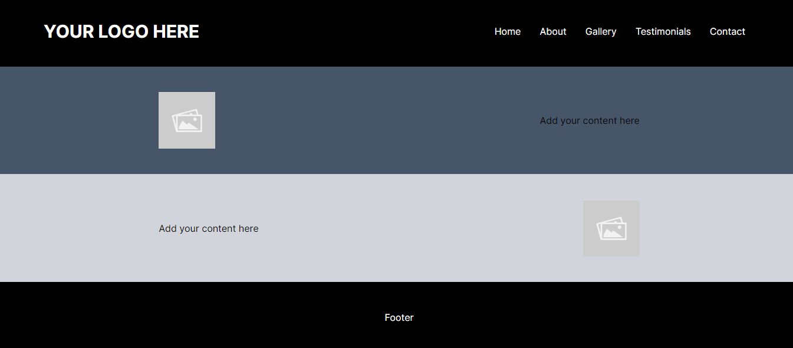
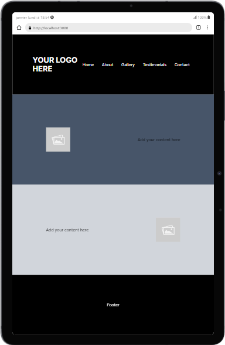
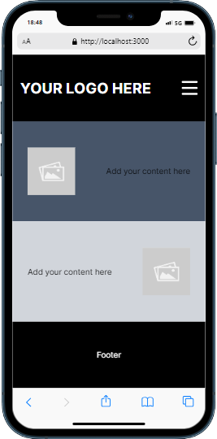
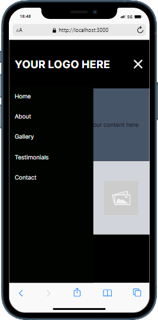
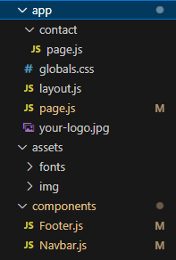

# next-web-starter

### Bootstrap your next web application and make your development process faster.

### Necessary knowledge to use this package

- React.js / Next.js
- Tailwind CSS

This repo was created to accelerate web development by providing all the basic setup for a project built with Next.js and Tailwind CSS, including basic components (navbar, footer) and pages (homepage, contact), as well as basic styling. Take it as a skeleton for a basic website so you can save yourself hours of work setting up a project.

All you need to do is to clone the repo.

It will clone an entire Next.js app with all the configuration done for you, including files and folders.

Navigate to the newly created app folder and then run:

```
npm install
```

You can then run the app using

```
npm run dev
```

It will launch the app on your local server (usually localhost:3000)

Note: this repo has been archived to avoid changes from third parties. A remote Git origin already exists in the files and you will have to change it if you want to push your code to Github. To proceed, I recommend opening a terminal in the root directory of the cloned project and prompt:

```
git remote set-url origin https://github.com/your-username/your-new-repo.git
```

Then just make whatever change to any file, I recommend changing the app name in the package.json file to your app name. Then in the same terminal:

```
git branch -M main
```
```
git push -u origin main
```

## Content of the repo:

The repo includes the whole setup for a basic app, all folders and mandatory files have been created for you. All you have to do is add your own content, modify styling and adjust the UI as you wish. The Navbar is fully responsive.

### Desktop view:



### Tablet view:



### Mobile view:




Here is how the app is structured, note that I chose not to use a /src folder, pages go under sub-folders located directly in the /app folder:



### Follow me!

Github: https://github.com/thomasaugot/ <br/>
Medium: https://medium.com/@thomasaugot <br/>
Linkedin: https://www.linkedin.com/in/thomas-augot/

### Visit my portfolio webpage:

https://thomasaugot.com/

Happy coding :)
